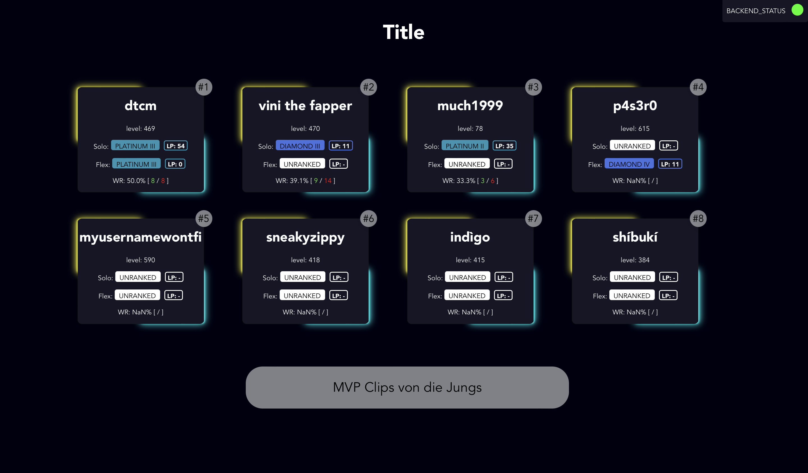
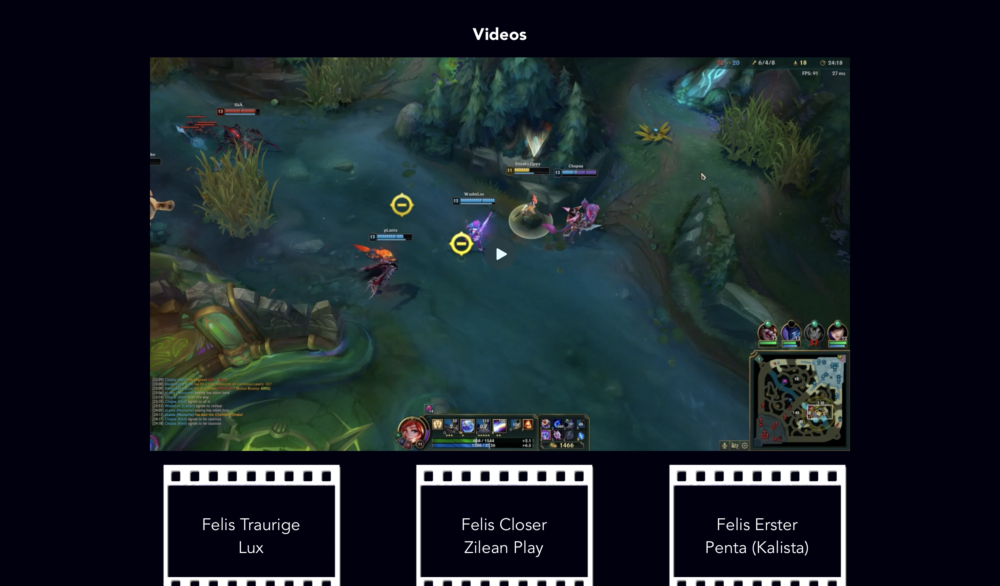

# Le4gue P4nel

This project is a League of Legends Panel designed to work on every Platform (Windows, Linux, Macos, Android, iOs, ...). It can be installed as PWA (Progressive Web App) or used directly in the browser. The Database is selfhosted and managed through an API. For setting up your own League of Legends Panel, set up the Database and the API and use this project you visualize it.

## 🎭 Features

- Display an arbitrary amount of Summoners on the main Page
- Show Solo and Flex Ranked
- Winrate indication
- Ranking System within the selected Summoner
- Show video Clips via link
- Backend Status indication

## 🔱 Install as PWA

To be able to install the `Le4gue P4nel`, simply head to [league.p4s3r0.com](https://league.p4s3r0.com) and a installation prompt should be shown. If no installation hint appears, click More (3 dots on the right top) and press on Install App. For further instructions get help [here](https://support.google.com/chrome/answer/9658361?hl=en-GB&co=GENIE.Platform%3DDesktop&sjid=3094928185029994952-EU)

## 📷 Screenshot

## 🃏 API Connection

| Function | Attributes | Explanation |
|----------|------------|-------------|
|`get_backend_status`| - |Returns the Backend Status (`true` or `false`)|
|`get_ranking`  | - | Returns the ranking of the Summoner (`name`, `rankingPoints`) |
|`get_summoner_info`| `name` | Returns an Array of `SoloInfo`, `FlexInfo` and `SummonerLevel` |
|`get_videos`| - | Returns an Array of `VideoName` and `VideoLink` of each Video. The Link is supposed to point to a Fileserver |

